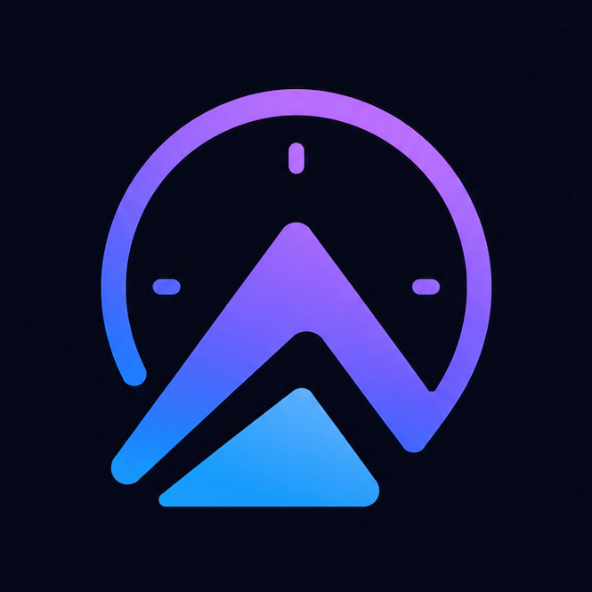

  

# Tympeak

**A no-nonsense productivity app — built in a day.**

Tasks, Habits, a Pomodoro timer, and Notes. All offline. No accounts, no cloud, no tracking.

---

## What's in it

- **Tasks** — priority, due dates, recurring days, custom notification time, swipe-to-delete with confirm.
- **Habits** — yes/no, countable, and timer types. Streaks, weekly heatmap, confetti when the day's done.
- **Timer** — Pomodoro work/break cycles with progress ring.
- **Notes** — Daily Journal (with mood + streak) and Quick Notes (autosave, search, pin, archive, markdown editor).
- **Settings** — JSON export/import for notes, CSV for habits, wipe-all switch.

## Design

Glassmorphism, dark, edge-to-edge, floating nav bar. Built around minimal taps — everything autosaves.

## Install

Grab the latest release APK and sideload it on Android.

## Stack

Flutter · Dart · Hive (local storage) · `flutter_local_notifications` · no backend.

## Built

In one day. The kind of side project that has no business existing, and that's the point.
